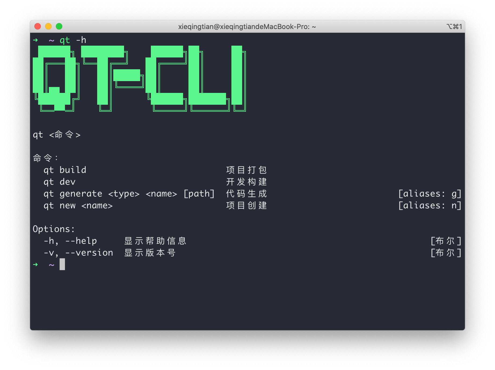
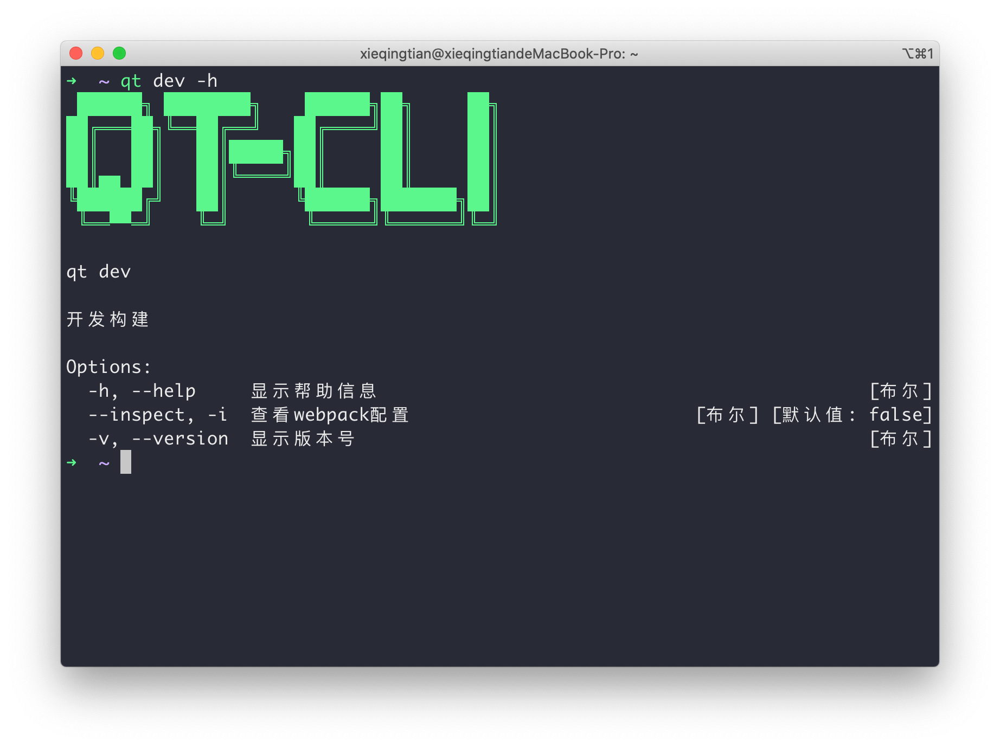

# qingtian-cli

> 一个专注于 react + typescript + electron 开发的工作流

# Install

```
yarn global add qingtian-cli
```

or

```
npm install qingtian-cli -g
```

# Contains

-   web 以及 electron 模板项目生成 ✅
-   常用代码文件生成 ✅
-   一键进入 webpack 开发模式和打包模式 ✅
-   内置 typescript 支持 ✅
-   内置 sass 支持 ✅
-   内置 postcss 支持 ✅
-   webpack 打包分析 ✅
-   `*.module.scss` 格式文件自动启动 css modules ✅
-   支持多页应用构建 ✅
-   antd 及 lodash 按需加载 ✅
-   splitChunks 拆包自动拆出 antd 相关包 ✅
-   代码热重载 ✅
-   构建进度条 ✅
-   根据 tsconfig paths 配置自动映射到 webpack alias ✅
-   moment locale 问题处理 ✅

# TodoList

-   webpack 对 svg 模块单独处理 ❌
-   [pont](https://github.com/alibaba/pont) 集成 ❌
-   nwjs 项目支持（待定） ❌
-   cli 运行速度优化 ❌
-   js 打包支持 ❌
-   less 支持 ❌
-   web 项目模板：路由及基础布局设计 ❌
-   electron 项目模板：typesafe ipc 设计 ❌

# Commands

-   **qt new**： 创建 web 或 electron 项目
-   **qt dev**： 启动项目开发
-   **qt build**： 生产环境构建
-   **qt generate**： 常用代码生成
-   **qt info**： 查看 cli 基本信息

# Config

新建一个 `qt.config.js` 置于项目根目录，内容如下

```js
module.exports = {
    electron: {
        rendererEntry: './src/renderer/index.tsx', // 配置渲染进程入口
        mainEntry: './src/main/index.ts' // 配置主进程入口
    },
    filenameHashing: true, // 生成的静态资源是否加hash以控制缓存
    template: 'public/index.html',
    filename: 'index.html',
    title: 'Webpack App',
    favicon: 'public/favicon.ico',
    sassResources: ['./src/renderer/sass/vars.scss', './src/renderer/sass/mixins.scss'], // sass工具注入
    pages: {
        // 多页面配置
        index: {
            entry: 'xxx',
            template: 'xxx',
            filename: 'xxx',
            title: 'xxx',
            favicon: 'xxxxx'
        },
        app: {
            entry: 'xxx',
            template: 'xxx',
            filename: 'xxx',
            title: 'xxx',
            favicon: 'xxxxx'
        }
    },
    // webpack配置扩展
    chainWebpack: config => {}
};
```

# Display





